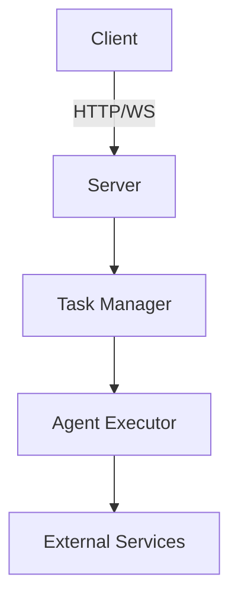

# A2A Node SDK

A TypeScript SDK for implementing the Agent-to-Agent (A2A) communication protocol, enabling seamless communication between AI agents.

This SDK provides a complete implementation of the A2A protocol specification, allowing developers to build, connect, and deploy intelligent agents. Developed by [Dexwox Innovations Pvt Ltd](https://dexwox.com) to offer a robust TypeScript solution for agent-based systems.

## Packages

### [@dexwox/a2a-node](/a2a-node)
Unified package that includes all Google A2A protocol components:
- Complete implementation of Google's A2A protocol in a single package
- Documentation and examples
- Simplified imports and usage

### [@dexwox/a2a-server](/packages/server)
Google A2A protocol server implementation with:
- HTTP/WebSocket interfaces compliant with Google's A2A specification
- Task management for A2A agents
- Request handling for agent communication
- Middleware support

### [@dexwox/a2a-client](/packages/client)
Client library for interacting with Google A2A protocol agents:
- Type-safe API client for Google's A2A protocol
- Circuit breaker pattern
- Error handling
- Message streaming

### [@dexwox/a2a-core](/packages/core)
Shared types and utilities for Google's A2A protocol:
- Google A2A protocol definitions and interfaces
- Validation decorators for protocol compliance
- Common utilities for working with A2A messages
- Error classes for protocol-specific error handling

## Getting Started

### Prerequisites
- Node.js 18+
- pnpm 8+

### Installation

#### For Development
```bash
git clone https://github.com/Dexwox-Innovations-Org/a2a-node-sdk.git
cd a2a-node-sdk
pnpm install
```

#### For Usage in Projects
```bash
# Install the unified package (recommended)
npm install @dexwox/a2a-node

# Or install individual packages if needed
npm install @dexwox/a2a-core
npm install @dexwox/a2a-client
npm install @dexwox/a2a-server
```

### Development
```bash
# Run all tests
pnpm test

# Start dev servers
pnpm dev
```

## Examples

Check out the [examples](/examples) directory for working code samples:

- **[Basic Client](/examples/basic-client)**: Simple client implementation showing how to connect to an A2A server
- **[Basic Server](/examples/basic-server)**: Simple server implementation demonstrating how to create and host an agent
- **[Weather Agent](/examples/weather-agent)**: Example agent implementation that processes weather-related queries
- **[Full Stack](/examples/full-stack)**: Complete example with client, server, and agent integration

## Architecture



## Documentation

- [API Reference](/docs/api.md) - Comprehensive reference for all A2A APIs
- [Protocol Specification](/docs/protocol.md) - Details of the A2A communication protocol
- [Development Guide](/docs/development.md) - Guide for developing with the A2A platform
- [Deployment Guide](/docs/deployment.md) - Strategies for deploying A2A applications to production
- [Integration Guide](/docs/integration.md) - Instructions for integrating A2A with other systems


## Contributing

Please read [CONTRIBUTING.md](CONTRIBUTING.md) for development guidelines.

## License

[Apache 2.0](LICENSE)

## Community

- [Code of Conduct](CODE_OF_CONDUCT.md)
- [Contributing Guidelines](CONTRIBUTING.md)
- [Report an Issue](https://github.com/Dexwox-Innovations-Org/a2a-node-sdk/issues)

## Legal

A2A protocol is a specification for agent communication. This implementation is provided by [Dexwox Innovations Pvt Ltd](https://dexwox.com). Google and A2A are trademarks of Google LLC.

## Features

- **Complete Protocol Implementation**: Full implementation of Google's A2A protocol specification
- **TypeScript Support**: Built with TypeScript for type safety and better developer experience
- **Modular Architecture**: Use the full package or individual components as needed
- **Extensible**: Easily extend with custom middleware and handlers
- **Well-Documented**: Comprehensive documentation and examples
- **Production-Ready**: Designed for reliability and performance in production environments

## Compatibility

This SDK is compatible with the following versions of Google's A2A protocol:

- A2A Protocol v1.0 (current stable version)

We strive to maintain compatibility with the latest protocol specifications as they evolve.

## Roadmap

- Enhanced WebSocket support for real-time agent communication
- Additional middleware for common use cases
- Performance optimizations for large-scale deployments
- Integration with popular AI frameworks

## Related Resources

- [Google A2A Protocol Documentation](https://developers.google.com/agent-to-agent) - Official documentation for Google's A2A protocol
- [A2A Protocol Specification](https://developers.google.com/agent-to-agent/reference) - Technical specification for the protocol

