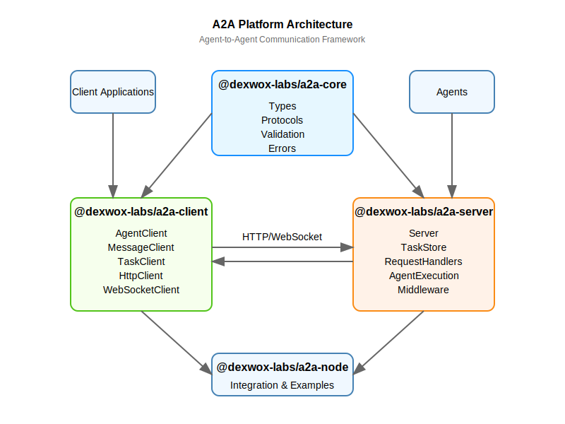

# A2A Architecture Overview

This document provides a high-level overview of the A2A (Agent-to-Agent) platform architecture.

## Core Components

The A2A platform consists of several key components:

### Core (@dexwox-labs/a2a-core)

The core package provides fundamental types, protocols, and utilities that are used by both clients and servers:

- **Types**: Defines the data structures used throughout the platform
- **Protocols**: Specifies the communication protocols between components
- **Validation**: Provides validation utilities for ensuring data integrity
- **Errors**: Standardized error handling across the platform
- **Telemetry**: Tools for monitoring and debugging

### Client (@dexwox-labs/a2a-client)

The client package provides libraries for connecting to A2A servers and interacting with agents:

- **AgentClient**: Discovers and manages agent connections
- **MessageClient**: Sends messages to agents and receives responses
- **TaskClient**: Manages task lifecycle and monitors task state
- **HttpClient**: Low-level HTTP client for A2A API communication

### Server (@dexwox-labs/a2a-server)

The server package provides the infrastructure for hosting A2A agents:

- **Server**: Core server implementation with HTTP and WebSocket support
- **TaskStore**: Manages task state and persistence
- **RequestHandlers**: Processes incoming requests and routes to appropriate handlers
- **AgentExecution**: Executes agent logic and manages agent lifecycle

### Node (@dexwox-labs/a2a-node)

The node package is the main entry point that integrates all components:

- **Integration**: Provides a unified API for the entire platform
- **Examples**: Includes example implementations and usage patterns
- **Documentation**: Comprehensive documentation for the platform

## Communication Flow

1. **Client Initialization**: Client applications initialize the A2A clients
2. **Agent Discovery**: Clients discover available agents through the AgentClient
3. **Message Sending**: Clients send messages to agents through the MessageClient
4. **Task Creation**: The server creates a task for each message
5. **Agent Execution**: The server routes the task to the appropriate agent
6. **Response Generation**: The agent processes the message and generates a response
7. **Task Completion**: The server updates the task state and stores the response
8. **Response Retrieval**: Clients retrieve the response through the TaskClient

## Task Lifecycle

Tasks in A2A go through the following states:

1. **Pending**: The task has been created but not yet processed
2. **In Progress**: The task is currently being processed by an agent
3. **Completed**: The task has been successfully completed
4. **Failed**: The task has failed due to an error

## Agent Cards

Agents in A2A are described by Agent Cards, which include:

- **ID**: Unique identifier for the agent
- **Name**: Human-readable name for the agent
- **Description**: Description of the agent's capabilities
- **Version**: Version of the agent
- **Capabilities**: List of capabilities the agent provides
- **Parameters**: Configuration parameters for the agent

## Message Format

Messages in A2A are composed of Message Parts, which can be:

- **Text**: Plain text content
- **Image**: Image data with MIME type
- **File**: File data with MIME type
- **Custom**: Custom data with a specified type

## Next Steps

- [Client Documentation](../client.md): Detailed documentation for the client libraries
- [Server Documentation](../server.md): Detailed documentation for the server implementation
- [Protocol Specification](../protocol.md): Detailed specification of the A2A protocol
- [Examples](../../examples/README.md): Example implementations of A2A components
