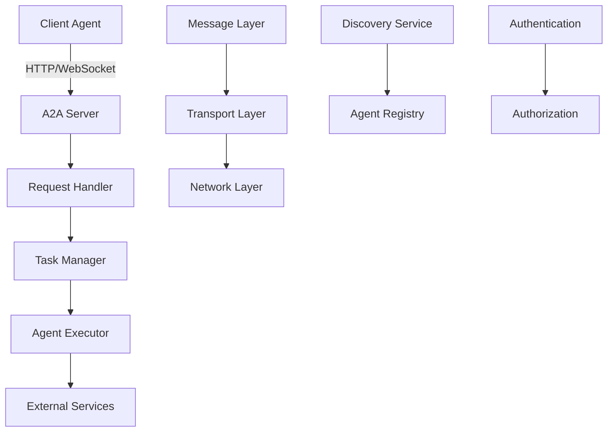
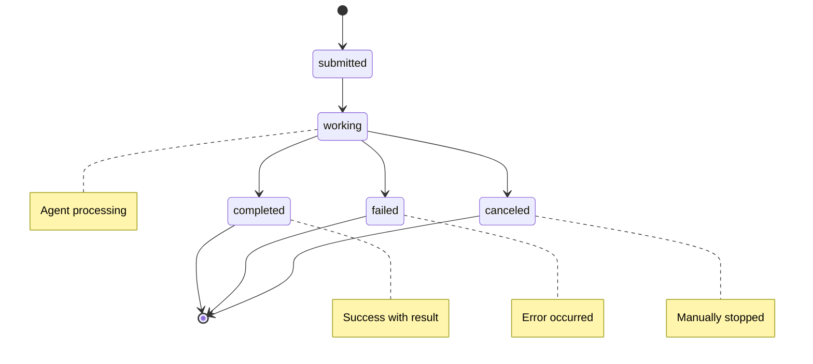

import { Callout } from 'nextra/components'

# Protocol Specification

This document provides a comprehensive overview of Google's Agent-to-Agent (A2A) communication protocol as implemented in the A2A Node SDK.

## Overview

The Agent-to-Agent (A2A) protocol is a standardized communication framework designed to enable seamless interaction between AI agents. It defines the structure, semantics, and lifecycle of agent communications.

### Key Principles

- **Standardization**: Common interface for all agent interactions
- **Reliability**: Built-in error handling and retry mechanisms
- **Scalability**: Support for high-volume agent communications
- **Extensibility**: Pluggable architecture for custom implementations
- **Security**: Authentication and authorization mechanisms

## Protocol Architecture



## Core Concepts

### Agents

Agents are autonomous entities that can process tasks and communicate with other agents.

#### Agent Card

Every agent must provide an Agent Card that describes its capabilities:

```typescript
interface AgentCard {
  id: string;                    // Unique agent identifier
  name: string;                  // Human-readable name
  description?: string;          // Agent description
  version: string;               // Agent version
  capabilities: string[];        // List of capabilities
  endpoint: string;              // Agent endpoint URL
  metadata?: Record<string, any>; // Additional metadata
  supportedTasks?: TaskDefinition[]; // Supported task types
}
```

**Example:**
```json
{
  "id": "weather-agent-v2",
  "name": "Weather Information Agent",
  "description": "Provides current weather and forecast data",
  "version": "2.1.0",
  "capabilities": [
    "weather-current",
    "weather-forecast",
    "location-services"
  ],
  "endpoint": "https://weather.example.com",
  "metadata": {
    "author": "Weather Corp",
    "license": "MIT",
    "regions": ["US", "EU", "APAC"]
  }
}
```

### Tasks

Tasks represent units of work that agents can execute.

#### Task Lifecycle



#### Task Structure

```typescript
interface Task {
  id: string;                    // Unique task identifier
  name: string;                  // Task name/type
  description?: string;          // Task description
  status: TaskStatus;            // Current status
  input?: any;                   // Task input data
  result?: any;                  // Task result (when completed)
  error?: string;                // Error message (when failed)
  artifacts?: Artifact[];        // Generated artifacts
  createdAt: string;             // ISO 8601 timestamp
  updatedAt: string;             // ISO 8601 timestamp
  transitions?: TaskTransition[]; // Status history
}

type TaskStatus = 'submitted' | 'working' | 'completed' | 'failed' | 'canceled';
```

**Example:**
```json
{
  "id": "task-12345",
  "name": "get-weather",
  "description": "Get current weather for New York",
  "status": "completed",
  "input": {
    "location": "New York, NY",
    "units": "metric"
  },
  "result": {
    "temperature": 22,
    "condition": "sunny",
    "humidity": 65
  },
  "artifacts": [
    {
      "id": "weather-data-1",
      "type": "json",
      "content": { "data": "..." },
      "createdAt": "2024-01-15T10:30:00Z"
    }
  ],
  "createdAt": "2024-01-15T10:30:00Z",
  "updatedAt": "2024-01-15T10:30:05Z"
}
```

### Messages

Messages enable real-time communication between agents.

#### Message Structure

```typescript
interface Message {
  id: string;                    // Unique message identifier
  conversationId?: string;       // Conversation grouping
  senderId: string;              // Sender agent ID
  recipientId: string;           // Recipient agent ID
  parts: MessagePart[];          // Message content parts
  timestamp: string;             // ISO 8601 timestamp
  metadata?: Record<string, any>; // Additional metadata
}

interface MessagePart {
  type: 'text' | 'file' | 'data';
  content: any;                  // Part-specific content
}
```

**Example:**
```json
{
  "id": "msg-67890",
  "conversationId": "conv-123",
  "senderId": "client-agent",
  "recipientId": "weather-agent",
  "parts": [
    {
      "type": "text",
      "content": "What's the weather like in Paris?"
    }
  ],
  "timestamp": "2024-01-15T10:30:00Z",
  "metadata": {
    "priority": "normal",
    "language": "en"
  }
}
```

### Artifacts

Artifacts are outputs generated by task execution.

```typescript
interface Artifact {
  id: string;                    // Unique artifact identifier
  type: string;                  // Artifact type (text, json, file, etc.)
  content: any;                  // Artifact content
  metadata?: Record<string, any>; // Additional metadata
  createdAt: string;             // ISO 8601 timestamp
  updatedAt: string;             // ISO 8601 timestamp
}
```

## HTTP API Specification

### Agent Discovery

#### Get Agent Card

```http
GET /.well-known/agent.json
```

**Response:**
```json
{
  "id": "weather-agent",
  "name": "Weather Agent",
  "version": "1.0.0",
  "capabilities": ["weather-data"],
  "endpoint": "https://weather.example.com"
}
```

#### Discover Agents

```http
POST /agents/discover
Content-Type: application/json

{
  "capabilities": ["weather-data"],
  "location": "US"
}
```

**Response:**
```json
{
  "agents": [
    {
      "id": "weather-agent",
      "name": "Weather Agent",
      "endpoint": "https://weather.example.com",
      "capabilities": ["weather-data"]
    }
  ]
}
```

### Task Management

#### Create Task

```http
POST /tasks
Content-Type: application/json

{
  "name": "get-weather",
  "description": "Get weather for location",
  "input": {
    "location": "New York, NY"
  }
}
```

**Response:**
```json
{
  "id": "task-12345",
  "name": "get-weather",
  "status": "submitted",
  "createdAt": "2024-01-15T10:30:00Z"
}
```

#### Get Task Status

```http
GET /tasks/{taskId}
```

**Response:**
```json
{
  "id": "task-12345",
  "name": "get-weather",
  "status": "completed",
  "result": {
    "temperature": 22,
    "condition": "sunny"
  },
  "createdAt": "2024-01-15T10:30:00Z",
  "updatedAt": "2024-01-15T10:30:05Z"
}
```

#### Cancel Task

```http
DELETE /tasks/{taskId}
```

**Response:**
```json
{
  "id": "task-12345",
  "status": "canceled",
  "updatedAt": "2024-01-15T10:31:00Z"
}
```

### Message Exchange

#### Send Message

```http
POST /messages
Content-Type: application/json

{
  "recipientId": "weather-agent",
  "parts": [
    {
      "type": "text",
      "content": "What's the weather in Paris?"
    }
  ]
}
```

**Response:**
```json
{
  "id": "msg-67890",
  "status": "sent",
  "timestamp": "2024-01-15T10:30:00Z"
}
```

#### Get Messages

```http
GET /messages?conversationId=conv-123&limit=50
```

**Response:**
```json
{
  "messages": [
    {
      "id": "msg-67890",
      "senderId": "client-agent",
      "recipientId": "weather-agent",
      "parts": [
        {
          "type": "text",
          "content": "What's the weather in Paris?"
        }
      ],
      "timestamp": "2024-01-15T10:30:00Z"
    }
  ],
  "hasMore": false
}
```

## WebSocket API Specification

### Connection

```javascript
const ws = new WebSocket('wss://agent.example.com/ws');
```

### Message Format

All WebSocket messages follow this format:

```typescript
interface WebSocketMessage {
  type: string;                  // Message type
  id?: string;                   // Optional message ID
  data?: any;                    // Message payload
  error?: {                      // Error information
    code: string;
    message: string;
  };
}
```

### Task Streaming

#### Subscribe to Task Updates

```json
{
  "type": "task:subscribe",
  "id": "req-1",
  "data": {
    "taskId": "task-12345"
  }
}
```

#### Task Update Notification

```json
{
  "type": "task:update",
  "data": {
    "id": "task-12345",
    "status": "working",
    "progress": 0.5,
    "updatedAt": "2024-01-15T10:30:03Z"
  }
}
```

### Message Streaming

#### Subscribe to Messages

```json
{
  "type": "message:subscribe",
  "id": "req-2",
  "data": {
    "conversationId": "conv-123"
  }
}
```

#### New Message Notification

```json
{
  "type": "message:new",
  "data": {
    "id": "msg-67891",
    "senderId": "weather-agent",
    "parts": [
      {
        "type": "text",
        "content": "The weather in Paris is 18°C and cloudy."
      }
    ],
    "timestamp": "2024-01-15T10:30:10Z"
  }
}
```

## Error Handling

### Error Response Format

```typescript
interface ErrorResponse {
  error: {
    code: string;                // Error code
    message: string;             // Human-readable message
    details?: any;               // Additional error details
    timestamp: string;           // ISO 8601 timestamp
  };
}
```

### Standard Error Codes

#### Task Errors

| Code | Description |
|------|-------------|
| `TASK_NOT_FOUND` | Task with specified ID not found |
| `TASK_ALREADY_COMPLETED` | Task is already in completed state |
| `TASK_ALREADY_CANCELED` | Task is already canceled |
| `INVALID_TASK_STATE` | Invalid state transition |
| `TASK_TIMEOUT` | Task execution timeout |
| `TASK_EXECUTION_FAILED` | Task execution failed |

#### Message Errors

| Code | Description |
|------|-------------|
| `AGENT_NOT_FOUND` | Target agent not found |
| `INVALID_MESSAGE_FORMAT` | Message format is invalid |
| `MESSAGE_TOO_LARGE` | Message exceeds size limit |
| `RATE_LIMIT_EXCEEDED` | Too many messages sent |

#### General Errors

| Code | Description |
|------|-------------|
| `AUTHENTICATION_REQUIRED` | Authentication is required |
| `AUTHORIZATION_FAILED` | Insufficient permissions |
| `VALIDATION_ERROR` | Request validation failed |
| `INTERNAL_SERVER_ERROR` | Unexpected server error |

### Error Examples

#### Task Not Found

```json
{
  "error": {
    "code": "TASK_NOT_FOUND",
    "message": "Task with ID 'task-12345' not found",
    "timestamp": "2024-01-15T10:30:00Z"
  }
}
```

#### Validation Error

```json
{
  "error": {
    "code": "VALIDATION_ERROR",
    "message": "Request validation failed",
    "details": {
      "field": "input.location",
      "reason": "Location is required"
    },
    "timestamp": "2024-01-15T10:30:00Z"
  }
}
```

## Authentication & Authorization

### Bearer Token Authentication

```http
Authorization: Bearer <token>
```

### API Key Authentication

```http
X-API-Key: <api-key>
```

### Agent-to-Agent Authentication

Agents can authenticate using mutual TLS or signed JWTs:

```typescript
interface AgentToken {
  iss: string;                   // Issuer (agent ID)
  aud: string;                   // Audience (target agent ID)
  sub: string;                   // Subject (requesting agent ID)
  exp: number;                   // Expiration timestamp
  iat: number;                   // Issued at timestamp
  capabilities: string[];        // Requested capabilities
}
```

## Rate Limiting

### Rate Limit Headers

```http
X-RateLimit-Limit: 1000
X-RateLimit-Remaining: 999
X-RateLimit-Reset: 1642248000
```

### Rate Limit Response

```json
{
  "error": {
    "code": "RATE_LIMIT_EXCEEDED",
    "message": "Rate limit exceeded. Try again in 60 seconds.",
    "details": {
      "limit": 1000,
      "remaining": 0,
      "resetTime": "2024-01-15T11:00:00Z"
    }
  }
}
```

## Content Types

### Supported Media Types

- `application/json` - JSON data
- `text/plain` - Plain text
- `application/octet-stream` - Binary data
- `multipart/form-data` - File uploads
- `application/x-ndjson` - Newline-delimited JSON (streaming)

### File Handling

#### File Upload

```http
POST /files
Content-Type: multipart/form-data

--boundary
Content-Disposition: form-data; name="file"; filename="data.csv"
Content-Type: text/csv

[file content]
--boundary--
```

#### File Reference in Messages

```json
{
  "type": "file",
  "content": {
    "id": "file-12345",
    "name": "data.csv",
    "mimeType": "text/csv",
    "size": 1024,
    "url": "https://agent.example.com/files/file-12345"
  }
}
```

## Versioning

### API Versioning

The A2A protocol supports versioning through:

1. **URL Path**: `/v1/tasks`, `/v2/tasks`
2. **Header**: `Accept: application/vnd.a2a.v1+json`
3. **Query Parameter**: `?version=1`

### Compatibility

- **Backward Compatibility**: New versions maintain compatibility with previous versions
- **Deprecation**: Old versions are deprecated with advance notice
- **Migration**: Clear migration paths provided for version upgrades

## Security Considerations

### Transport Security

<Callout type="warning">
Always use HTTPS/WSS in production environments to ensure data encryption in transit.
</Callout>

- **TLS 1.2+**: Minimum required version
- **Certificate Validation**: Proper certificate chain validation
- **HSTS**: HTTP Strict Transport Security headers

### Input Validation

- **Schema Validation**: All inputs validated against JSON schemas
- **Sanitization**: User inputs sanitized to prevent injection attacks
- **Size Limits**: Maximum payload sizes enforced

### Access Control

- **Authentication**: Verify agent identity
- **Authorization**: Check agent permissions
- **Capability-based**: Access control based on agent capabilities

## Performance Guidelines

### Request Optimization

- **Compression**: Use gzip/deflate compression
- **Caching**: Implement appropriate caching strategies
- **Connection Pooling**: Reuse HTTP connections
- **Batch Operations**: Group multiple operations when possible

### Timeout Configuration

| Operation | Recommended Timeout |
|-----------|-------------------|
| Agent Discovery | 5 seconds |
| Task Creation | 10 seconds |
| Task Execution | 5 minutes |
| Message Send | 30 seconds |
| File Upload | 2 minutes |

### Monitoring

- **Health Checks**: Regular endpoint health monitoring
- **Metrics**: Track request rates, response times, error rates
- **Logging**: Comprehensive request/response logging
- **Alerting**: Automated alerts for failures

## Implementation Notes

### SDK Compliance

The A2A Node SDK implements this specification with:

- **Full Protocol Support**: All endpoints and features
- **Type Safety**: TypeScript interfaces for all protocol types
- **Error Handling**: Comprehensive error handling and retry logic
- **Performance**: Optimized for high-throughput scenarios

### Extension Points

The protocol allows for extensions through:

- **Custom Headers**: Additional metadata in HTTP headers
- **Metadata Fields**: Extensible metadata in core types
- **Custom Artifacts**: Agent-specific artifact types
- **Middleware**: Custom request/response processing

## Next Steps

- **[Client Guide](/docs/client)** - Learn how to build A2A clients
- **[Server Guide](/docs/server)** - Learn how to build A2A servers
- **[Examples](/docs/examples)** - See real-world implementations
- **[API Reference](/api-reference)** - Complete API documentation
