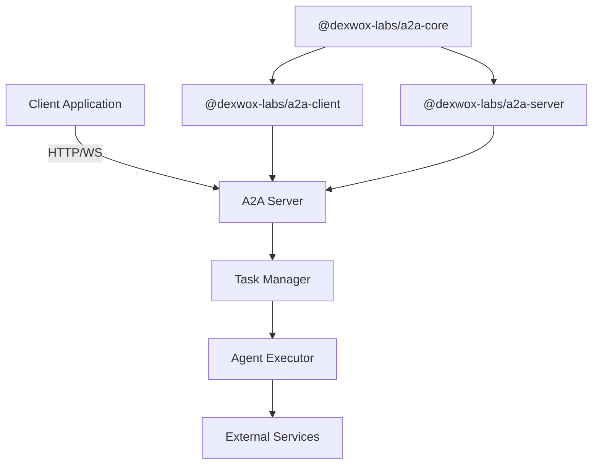

import { Callout } from 'nextra/components'

# A2A Node SDK

A comprehensive TypeScript SDK for implementing Google's Agent-to-Agent (A2A) communication protocol, enabling seamless communication between AI agents.

## Features

- **🚀 Complete Protocol Implementation**: Full implementation of Google's A2A protocol specification
- **📝 TypeScript Support**: Built with TypeScript for type safety and better developer experience
- **🔧 Modular Architecture**: Use the full package or individual components as needed
- **⚡ Production Ready**: Designed for reliability and performance in production environments
- **📚 Well Documented**: Comprehensive documentation and examples
- **🔌 Extensible**: Easily extend with custom middleware and handlers

## Quick Start

- **📦 [Installation](/docs/getting-started)** - Get started with A2A Node SDK in minutes
- **🏗️ [Client Guide](/docs/client)** - Learn how to build A2A clients  
- **🖥️ [Server Guide](/docs/server)** - Set up A2A protocol servers
- **📖 [API Reference](/api-reference)** - Complete API documentation

## Installation

```bash
# Install the unified package (recommended)
npm install @dexwox-labs/a2a-node

# Or install individual packages
npm install @dexwox-labs/a2a-core @dexwox-labs/a2a-client @dexwox-labs/a2a-server
```

## Basic Usage

### Client Example

```typescript
import { MessageClient, AgentClient } from '@dexwox-labs/a2a-node';

// Create clients
const messageClient = new MessageClient({ 
  baseUrl: 'https://a2a-server.example.com' 
});
const agentClient = new AgentClient({ 
  baseUrl: 'https://a2a-server.example.com' 
});

// Discover agents
const agents = await agentClient.resolveAgents();
console.log('Available agents:', agents);

// Send a message
const messageId = await messageClient.sendMessage([
  { type: 'text', content: 'Hello, agent!' }
], agents[0].id);
console.log('Message sent with ID:', messageId);
```

### Server Example

```typescript
import { A2AServer, DefaultAgentExecutor } from '@dexwox-labs/a2a-node';

// Create agent executor
const executor = new DefaultAgentExecutor({
  async executeTask(task) {
    // Your agent logic here
    return {
      status: 'completed',
      result: `Processed: ${task.name}`
    };
  }
});

// Create and start server
const server = new A2AServer({
  agentCard: {
    id: 'my-agent',
    name: 'My Agent',
    capabilities: ['text-processing'],
    endpoint: 'http://localhost:3000'
  },
  executor
});

await server.start(3000);
console.log('A2A server running on port 3000');
```

## Architecture

The A2A Node SDK follows a modular architecture with three main packages:



## Packages Overview

### Core Package (`@dexwox-labs/a2a-core`)
- Protocol type definitions and interfaces
- Validation utilities and decorators
- Common utilities for working with A2A messages
- Error classes for protocol-specific error handling

### Client Package (`@dexwox-labs/a2a-client`)
- Type-safe API client for A2A protocol
- Agent discovery and management
- Message streaming with retry logic
- Circuit breaker pattern for resilience

### Server Package (`@dexwox-labs/a2a-server`)
- Express-based HTTP/WebSocket server
- Task management and state tracking
- Request handling and routing
- Middleware support for extensibility

## Community

- [GitHub Repository](https://github.com/Dexwox-Innovations-Org/a2a-node-sdk)
- [Github Discussions](https://github.com/Dexwox-Innovations-Org/a2a-node-sdk/discussions)
- [Contributing Guidelines](/docs/contributing)
- [Code of Conduct](/docs/code-of-conduct)

## License

Licensed under the [Apache 2.0 License](https://github.com/Dexwox-Innovations-Org/a2a-node-sdk/blob/main/LICENSE).

---

Built with ❤️ by [Dexwox Innovations Pvt Ltd](https://dexwox.com)
