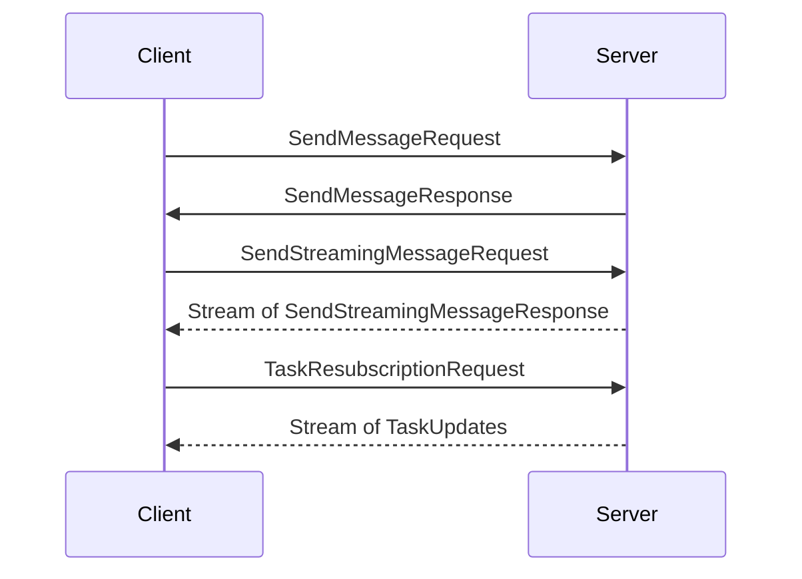
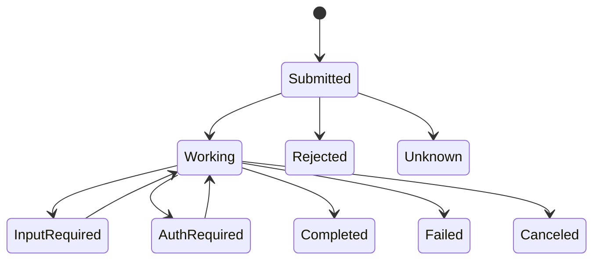

# A2A Protocol Node.js SDK Product Requirements Document

## Overview
The Node.js SDK will implement the Google A2A protocol, providing both client and server implementations that mirror the functionality of the Python SDK.

## Architecture

### Core Components

1. **Agent Execution Framework**
   - Base AgentExecutor interface
   - Event queue implementation
   - Task lifecycle event system
   - Standardized execution patterns:
     * Message processing
     * Stream handling
     * Task cancellation
     * Resubscription support
   - Artifact handling system

1. **Types Module**
   - Core JSON-RPC models:
     * Request/Response/Error structures (fully typed with Zod schemas)
     * Message protocols (2.0) with all message part types:
       - TextPart: Plain text content with metadata
       - FilePart: File content (bytes or URI) with metadata
       - DataPart: Structured data with metadata
   - Task models:
     * Task lifecycle states (submitted, working, completed, canceled, failed, rejected, auth-required, unknown)
     * State transition rules and constraints
     * State transition history
     * Task artifacts and status updates
   - Error handling:
     * Standardized error codes (-32000 to -32099 for A2A-specific errors)
     * Error hierarchy and inheritance
     * Detailed error metadata requirements
   - Agent capabilities:
     * pushNotifications
     * stateTransitionHistory
     * streaming
   - Agent skill definitions:
     * Input/output modes
     * Examples
     * Tags

2. **Client Implementation**
   - HTTP client using fetch API with:
     * Automatic retry policies (exponential backoff)
     * Circuit breaker pattern implementation
     * Request/response validation
   - Streaming support:
     * SSE (Server-Sent Events) implementation
     * WebSocket fallback mechanism
     * Backpressure handling
     * Resubscription support
   - Push notification support:
     * Configuration management
     * Authentication handling
   - Agent card:
     * Resolution protocol (/.well-known/agent.json)
     * Caching strategy (TTL-based)
     * Automatic refresh on error
   - Task management:
     * Status queries
     * Cancellation
     * State transition history

3. **Server Implementation**
   - Request handler interface:
     * Mandatory methods with exact signatures
     * Streaming contract requirements
     * Error handling requirements
   - Middleware support:
     * Authentication middleware interface
     * Rate limiting implementation
     * Request validation pipeline
   - Task storage:
     * Base interface with CRUD operations
     * Transaction requirements
     * Performance expectations (1000+ TPS)
   - Event streaming:
     * Advanced EventQueue system with:
       - Child queue branching (tap())
       - Multiple specific event types
       - Queue shutdown capability
     * ResultAggregator pattern for collecting task results
     * SSE protocol implementation
     * Connection management
     * Heartbeat mechanism
     * Streaming message resubscription support
   - Push notification configuration:
     * Task-level push notification settings
     * Configuration persistence requirements
     * Authentication requirements
     * Change notification handling
   - Artifact handling:
     * Artifact storage
     * Artifact update events
     * Artifact metadata

### Package Structure

```
a2a-sdk/
├── packages/
│   ├── core/          # Shared types and utilities
│   │   ├── src/
│   │   │   ├── types/       # All protocol types
│   │   │   ├── validation/  # Zod schemas
│   │   │   └── utils/       # Shared utilities
│   ├── client/        # Client implementation  
│   │   ├── src/
│   │   │   ├── http/        # HTTP client
│   │   │   ├── streaming/   # SSE/WebSocket
│   │   │   ├── push/        # Push notifications
│   │   │   └── errors/      # Error handling
│   ├── server/        # Server implementation
│   │   ├── src/
│   │   │   ├── handlers/    # Request handlers
│   │   │   ├── middleware/  # Auth, rate limiting
│   │   │   ├── storage/     # Task stores
│   │   │   └── artifacts/   # Artifact handling
│   └── examples/      # Example implementations
├── package.json
└── tsconfig.json
```

## Technical Specifications

### Protocol Details

1. **Message Flow**


2. **Error Handling**
   - Standard error codes:
     * -32700 to -32600: JSON-RPC standard errors
     * -32000 to -32099: A2A-specific errors:
       - -32001: Task not found
       - -32002: Task not cancelable
       - -32003: Push Notification not supported
       - -32004: Unsupported operation
       - -32005: Content type not supported
       - -32006: Invalid agent response
   - Error metadata requirements:
     * Timestamp
     * Trace ID
     * Context information

3. **Task State Machine**


### Performance Requirements

1. **Client**
   - Latency: <100ms for local requests
   - Throughput: 100+ concurrent streams
   - Memory: <50MB baseline

2. **Server**
   - Latency: <50ms for simple requests
   - Throughput: 1000+ TPS
   - Memory: <100MB baseline

### Testing Strategy

1. **Unit Tests**
   - 100% coverage for core types
   - 90%+ coverage for client/server

2. **Integration Tests**
   - Client-server communication
   - Error scenarios
   - Streaming behavior
   - Push notifications
   - Artifact handling

3. **Load Tests**
   - 1000+ concurrent connections
   - Long-running streams (24h+)
   - Failure recovery scenarios
   - Push notification stress testing
